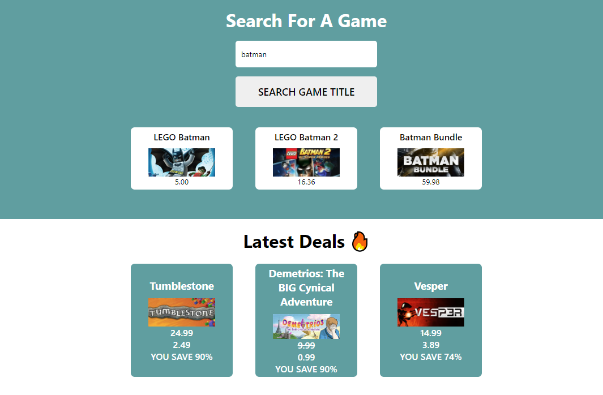

# Game Deals Site
I made this with the help of [CheapShark](https://apidocs.cheapshark.com/) Api.

It lets us search for games and deals on games , we can use this to get a good deal on games that have good ratings on steam.

#### I learned about:

- Reading through API docs to get the relavant data to build this website.
- Using the [SWR](https://swr.vercel.app/) library to make the API calls , so that we always have the latest data related to new deals.

#### What can this app do?
1. Search for games based on keyword provided in input
2. Show latest deals on games as soon as the user visits the website.

### Demo

### Screenshot

